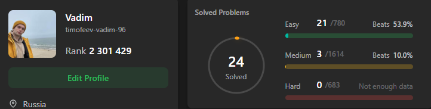

 

 Привет! 👋 Я Java-разработчик из Санкт-Петербурга. 
 

  
  Мой телеграм:
   

   📫 Моя почта: <a href='mailto:timofeev.vadim.96@mail.ru'>timofeev.vadim.96@mail.ru</a>

<!--
**timofeev-vadim-96/timofeev-vadim-96** is a ✨ _special_ ✨ repository because its `README.md` (this file) appears on your GitHub profile.

Here are some ideas to get you started:

- 🔭 I’m currently working on ...
- 🌱 I’m currently learning ...
- 👯 I’m looking to collaborate on ...
- 🤔 I’m looking for help with ...
- 💬 Ask me about ...
- 📫 How to reach me: ...
- 😄 Pronouns: ...
- ⚡ Fun fact: ...
-->
